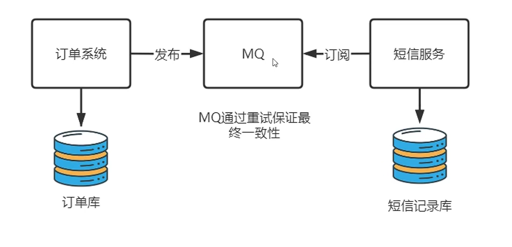
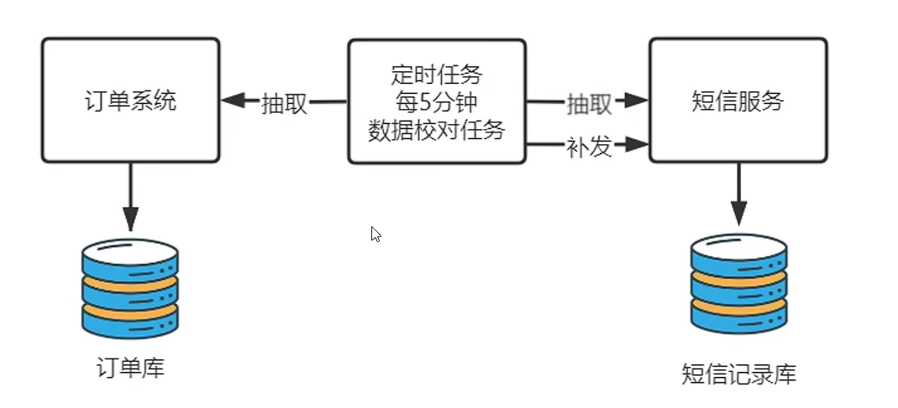
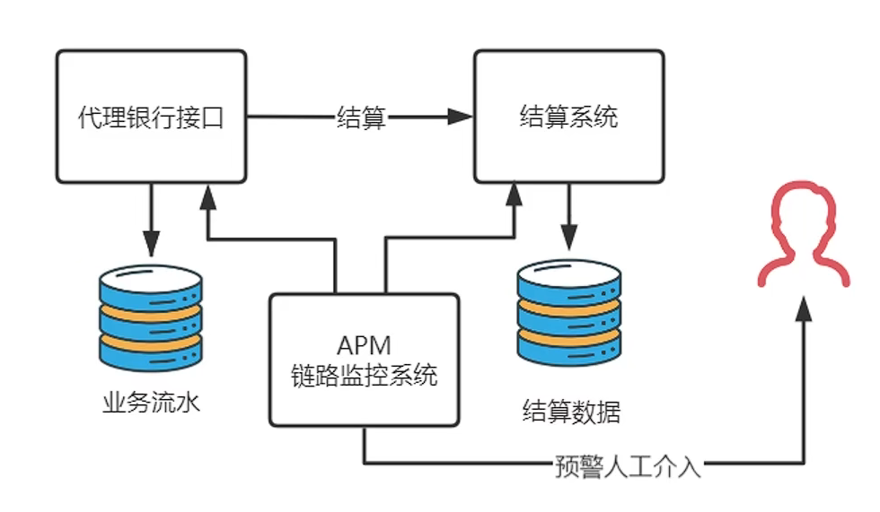
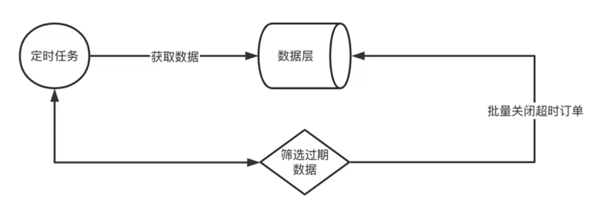
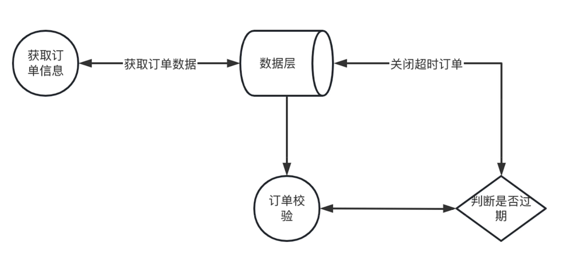
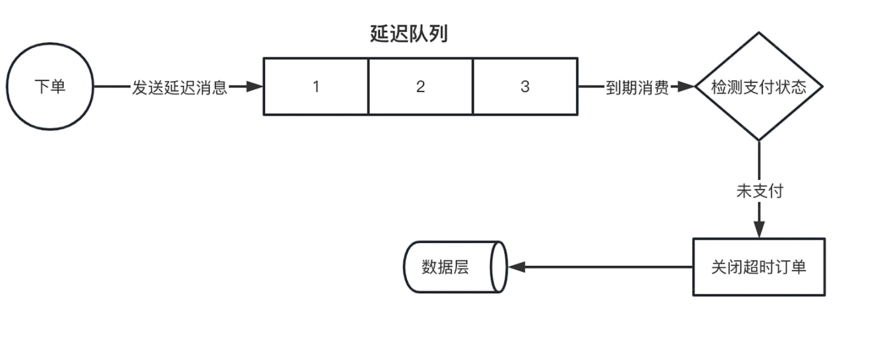
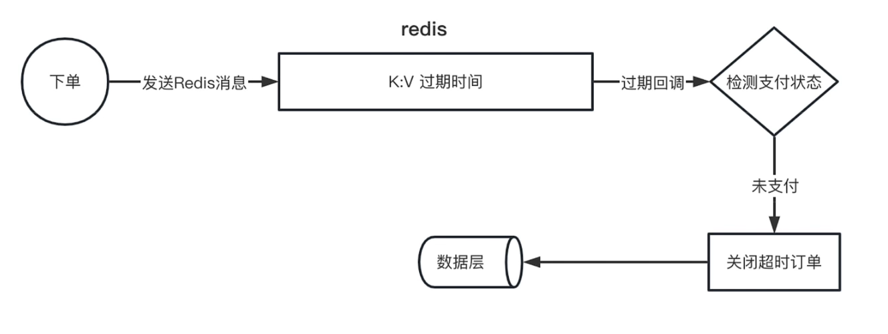
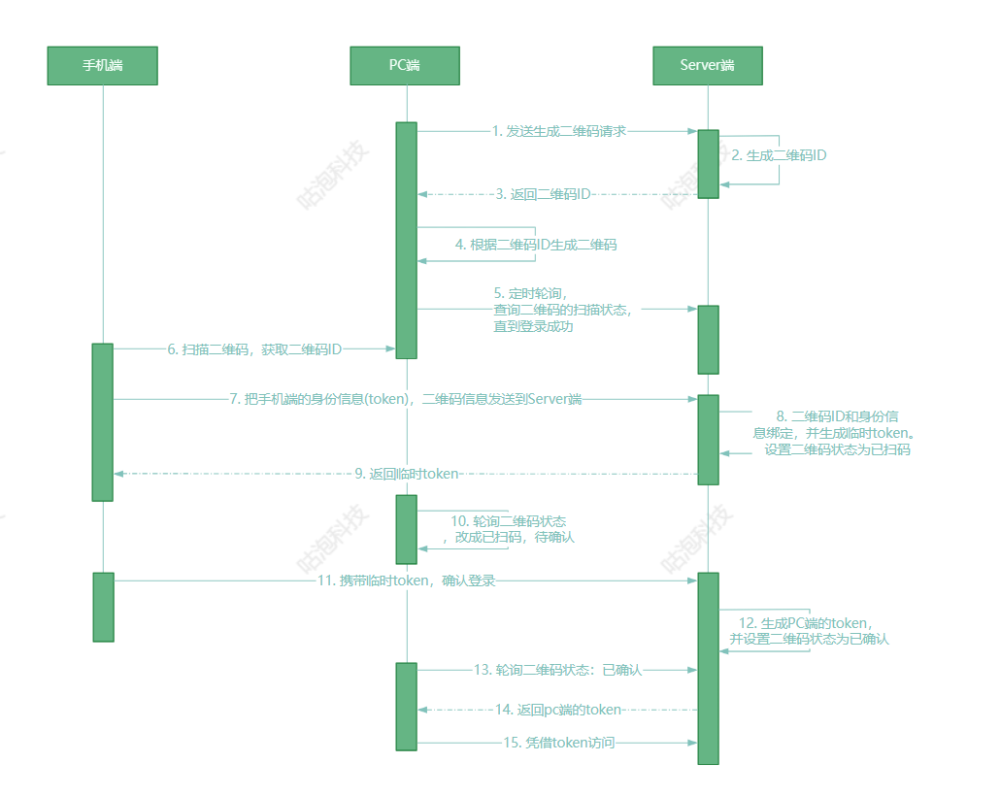

### 1.什么是前后端分离，为什么现在绝大多数互联网公司使用的都是前后端分离架构？

前后端分离是指将应用程序的前端（用户界面、交互逻辑等）和后端（业务逻辑、数据处理、数据库操作等）分别开发、部署和维护，使得前端和后端可以独立开发、测试和部署，从而提高开发效率和质量。

**纯后端渲染架构的缺点**

- 前端团队无法单独调试


- 前后端职责不清，分工不明
- 不具备多端应用的潜力

**前后端分离架构的优点**

1. 提高开发效率：前后端分离使得前端和后端可以独立开发，无需等待对方完成工作，从而提高开发效率。前端开发人员可以专注于设计和开发用户界面和交互逻辑，而后端开发人员可以专注于业务逻辑和数据处理，减少了彼此之间的干扰和等待时间。
2. 支持多平台：前后端分离使得前端和后端可以独立部署和维护，从而支持多个平台和设备。例如，可以开发一个Web应用程序，同时支持PC端、移动端和平板电脑等设备，或者开发一个基于RESTful API的移动应用程序，从而可以支持不同类型的移动设备。
3. 提高应用程序的可扩展性：前后端分离使得前端和后端可以独立扩展，从而提高应用程序的可扩展性。例如，可以增加前端服务器的数量，以处理更多的用户请求；或者增加后端服务器的数量，以处理更多的业务逻辑和数据处理。
4. 提高应用程序的安全性：前后端分离使得前端和后端可以独立实现安全措施，从而提高应用程序的安全性。例如，可以在前端实现防止跨站点脚本攻击（XSS）的安全措施，而在后端实现防止SQL注入攻击的安全措施。


### 2.为什么大厂要做数据垂直分表

**垂直分表**：将一张大表按照“列”拆分为2张以上的小表，通过主外键关联获取数据。一般会将常用的字段放在一个表中，将不常用的字段放到另一张表中。

原因：

1. **业务解耦**：将多个业务模块拆分到不同的表中，可以减少表之间的耦合度，方便进行单独部署和维护，同时也有利于业务的扩展和迭代。
2. **性能优化**：将一个大表拆分成多个小表后，可以减小单表的数据量，提高查询速度和响应性能。同时也可以根据业务需求，将高频访问的字段和低频访问的字段分别放在不同的表中，从而达到提高查询性能的目的。通过将重要字段单独剥离出一张小表，让每一页能够容纳更多的行，进而缩小数据扫描的范围，提高执行效率。
3. 数据安全：将敏感数据和非敏感数据分别存储在不同的表中，可以提高数据的安全性和隐私保护，减少数据泄露的风险。
4. 节约成本：通过数据垂直分表，可以将不同类型的数据存储在不同的表中，从而避免了对同一张表进行频繁的DDL操作，减少数据库维护和升级的成本。

### 3.为什么要做多级缓存

> 多级缓存通常由几种不同类型的缓存组成，例如本地缓存、分布式缓存（redis）和CDN缓存等。多级缓存的主要目的是在提高数据访问速度的同时，减轻后端存储设备的负载，提高系统的可伸缩性和可用性。
>
> 1. 本地缓存：位于应用程序内存中，是最快的缓存层，可以快速响应读取请求，减少对后端存储的访问，提高系统的性能。
> 2. 分布式缓存：位于多个应用程序之间共享的缓存服务中，可以缓存经常被读取的数据，减轻后端存储设备的负载，提高系统的可伸缩性和可用性。
> 3. 后端存储：位于磁盘等后端存储设备中，用于持久化存储数据，当本地缓存和分布式缓存中没有命中需要的数据时，才会从后端存储中读取数据。

1. 提高系统的**性能和可用性**，从而满足系统的高并发、低延迟和高可靠性：一级缓存可以缓存热点数据，避免频繁访问数据库，提高系统响应速度；二级缓存可以缓存一些较少使用但又不适合放在一级缓存中的数据，进一步减轻数据库负载，提高系统性能。
2. 减轻数据库负载：多级缓存可以将热点数据缓存在内存中，避免频繁访问数据库，减轻数据库负载，提高数据库的稳定性和可靠性。
3. 改善用户体验：多级缓存可以大大缩短数据访问的响应时间，从而提高用户体验。

### 4.数据库水平分表按范围分表的优缺点

通常是按主键id进行范围分片


优点：

- 容易理解，易于扩展

缺点：

- 必须提前做好分片规划，会造成资源浪费
- 会产生“尾部热点”效应

### 5.MQ中间件是如何实现可靠性投递的

MQ中间件实现可靠性投递的主要方式是采用**ACK机制**。发送阶段，遇到高延迟，Producer会多次重发消息，直到Broker ACK确认，过程中Broker会自动去重，超时Producer产生异常，应用进行捕获提示。当消费者接收到消息时，需要发送一个ACK给MQ服务器，告诉服务器已经正确地接收到了消息。如果MQ服务器在一定时间内没有收到ACK，则认为该消息没有被正确处理，会将其重新投递给消费者，直到收到ACK为止。

此外，MQ中间件还会对消息进行**持久化处理**，保证消息在发送过程中不会丢失。Broker先刷盘再ack,即使ack失败消息不会丢失，多次重试直到Producer接收。

还可以使用**消息重试机制**、消费者负载均衡机制等。同时，为了防止消息被重复投递，MQ中间件还会使用消息去重机制（处理幂等性），保证每条消息只会被处理一次。

### 6.什么是最终一致性，有哪些手段可以保证最终一致性

最终一致性是指在分布式系统中，经过一段时间的数据同步和协调后，系统的所有副本最终达到一致的状态。

在分布式系统中，由于网络延迟、节点故障等原因，数据的复制和同步可能会有一定的延迟和不一致性。因此，最终一致性不要求系统的所有副本立即达到一致，而是允许一定的时间窗口来保证数据的最终一致性。

**如何保证：**

- **重试**

  比如在订单系统和短信服务中，商家在每条订单下单后都会发送一条订单短信通知买家，订单系统和短信服务是两个独立的服务，那么应该如何保证每个订单都会发送短信呢？可以使用消息中间件MQ异步解耦，通过发布订阅以及MQ本身的重试机制保证服务的最终一致性

  


- **数据校对程序**

  通过数据校对程序每隔一段时间抽取订单系统中未发送短信的订购进行补发（**补偿机制**）。

  


- **本地消息表**

  和数据校对程序本质差不多

  

- **人工介入**

  运维人员通过APM链路监控系统进行人工补偿



### 7.什么是单点登录，怎样设计（或者说具体流程是怎样的）

单点登录（Single Sign-On，简称SSO）是一种身份验证和授权机制，允许用户在多个应用系统中使用同一组凭据（如用户名和密码）进行登录，从而实现在不同系统之间的无缝登录体验。用户只需登录一次，即可在多个系统中自动登录，而无需为每个系统单独输入凭据。

**流程：**

- **同域**下的单点登录：

  假如有三个网站sso.a.com、app1.a.com、app2.a.com

  我们只要在sso.a.com登录，app1.a.com和app2.a.com就也登录了。

  sso登录以后，可以将Cookie的域设置为顶域，即.a.com，这样所有子域的系统都可以访问到顶域的Cookie。

  那么sso登录以后，app1和app2如何通过Cookie得到session呢，这里就需要将三个系统的session共享了。

  说明一下，这并不是真正的单点登录。


- **不同域**下的单点登录：

假设有app1和app2两个系统（这两个系统都还没完成登录验证，并且是不同域的）以及一个统一认证中心SSO

1. 用户访问app1系统，app1系统是需要登录的，但用户现在没有登录。
2. 跳转到CAS server，即SSO登录系统。SSO系统也没有登录，弹出用户登录页。
3. 用户填写用户名、密码，SSO系统进行认证后，将登录状态写入SSO的session，浏览器（Browser）中写入SSO域下的Cookie。
4. SSO系统登录完成后会生成一个身份令牌**ST（Service Ticket）**，然后跳转到app1系统，同时将ST作为参数传递给app1系统。
5. app1系统拿到ST后，从后台向SSO发送请求，**验证**ST是否有效。
6. 验证通过后，app1系统将登录状态写入session并设置app1域下的Cookie。

至此，跨域单点登录就完成了。以后我们再访问app1系统时，app1就是已登录的。接下来是访问app2系统时的流程：

1. 用户访问app2系统，app2系统没有登录，跳转到SSO。
2. **由于SSO已经登录了，不需要重新登录认证**。
3. SSO生成ST，浏览器跳转到app2系统，并将ST作为参数传递给app2。
4. app2拿到ST，后台访问SSO，验证ST是否有效。
5. 验证成功后，app2将登录状态写入session，并在app2域下写入Cookie。

这样，app2系统不需要走登录流程，就已经是登录了。SSO，app1和app2在不同的域，它们之间的session不共享也是没问题的。


### 8.设计一个订单超时未支付关闭订单的解决方案（秒杀场景中）

> 字节二面

注意订单超时并不仅仅只是关闭订单，还需要减库存、通知等一些列操作

**方法一：扫表轮询**

此方案比较简单，我们只需要开一个定时任务扫描订单表，获取待支付状态的订单数据，判断订单是否超时，如果超时则关闭订单并进行减库存等操作。



缺点：

- 大量数据集，对**服务器内存**消耗大。    
- 数据库频繁查询，订单量大的情况下，**IO**是瓶颈。
- 存在延迟，间隔短则耗资源，间隔长则时效性差，两者是一对矛盾。
- 不易控制，随着定时业务的增多和细化，每个业务都要对订单重复扫描，引发查询浪费

**方法二：懒删除**

我们只在用户查询订单的时候进行一个订单的校验，判断是否超时



缺点：

如果用户一直不查询订单，那么订单会被一直挂起，没有支付也没有取消，库存依旧占着。如果再业务上这种延迟操作不能接收，那么此方案也用不了


**方法三：消息队列**

通过消息队列中的延迟队列实现



优点：

- 可以随时在队列移除，实现实时取消订单，及时恢复订单占用的资源（如商品）
- 消息存储在mq中，不占用应用服务器资源
- 异步化处理，一旦处理能力不足，consumer集群可以很方便的扩容

缺点：

- 可能会导致消息大量堆积
- mq服务器一旦故障重启后，持久化的队列过期时间会被重新计算，造成精度不足
- 死信消息可能会导致监控系统频繁预警

**方法四：Redis实现**

利用redis的notify-keyspace-events，该选项默认为空，改为Ex开启过期事件，配置消息监听。每下一单在redis中放置一个key（如订单id），并设置过期时间



优点：

- 消息都存储在Redis中，不占用应用内存
- 外部redis存储，应用down机不会丢失数据
- 做集群扩展相当方便
- 依赖redis超时，时间准确度高

缺点：

- 订单量大时，每一单都要存储redis内存，需要大量redis服务器资源


### 9.如何避免订单重复提交支付？

- 前端的防抖处理

  防止用户在快速点击时可能会提交两个一模一样的订单

  我们可以在用户点击提交按钮时跳转到一个提交中的页面，防止用户重复提交。


- 服务端的幂等处理

  - token机制

    服务端生成一个token，可以存在redis中，并设置过期时间，用户在提交或支付订单前会获取该token，然后携带该token将请求发送给服务端，服务端会判断该token是否存在redis中，若存在，说明是第一次请求，处理该请求并删除token，若不存在，说明是重复提交的请求，不处理

  - 根据订单号进行幂等处理

### 10.扫码登录到底是怎么实现的？



### 11.如何解决超卖问题？比如在秒杀商城的业务场景中

超卖问题指的是在并发环境下，多个用户同时购买同一商品或资源，导致库存数量超过实际可售数量的情况。为解决超卖问题，可以采取以下几种方法：

1. **悲观锁**（Pessimistic Locking）：在并发访问资源时，使用锁机制对资源进行加锁，确保同一时间只有一个用户能够执行购买操作。比如，在数据库操作中使用行级锁或表级锁（select for update），限制并发访问。这种方法可以保证数据的一致性，但会降低系统的并发性能。

2. **乐观锁**（Optimistic Locking）：在并发访问资源时，使用版本号或时间戳等机制进行乐观并发控制。每个用户在购买之前获取资源的版本号，并在购买时验证版本号是否仍然匹配。如果版本号匹配，则进行购买操作；如果不匹配，则表示资源已被其他用户修改，购买操作失败。这种方法避免了直接的加锁，提高了系统的并发性能，但需要处理并发冲突的情况。

   ```sql
   -- 版本号实现乐观锁
   select version from goods WHERE id= 1001;
   update goods set num = num - 1, version = version + 1 WHERE id= 1001 AND num > 0 AND version = @version(上面查到的version);
   ```

   ​

3. **预减库存**：在用户下单前，先将商品的库存数量预先进行占用。当用户提交订单时，再对库存进行实际的扣减。这样可以确保即使在下单之后出现并发请求，预占的库存数量也会保留给该用户，避免了超卖问题。如果用户在一定时间内没有支付订单，则释放预占的库存。

   在秒杀的情况下，高频率的去读写数据库，会严重造成性能问题。所以必须借助其他服务， 利用 redis 的单线程预减库存。比如商品有 100 件。那么可直接利用redis的原子性操作incre和decr。例如

   每一个用户线程进来，key 值就incre，等减到 0 的时候，全部拒绝剩下的请求。

   那么也就是只有 100 个线程会进入到后续操作。所以一定不会出现超卖的现象。

4. **队列和消息机制**：将用户的购买请求放入一个消息队列中，并使用消息机制逐个处理购买请求。这样可以保证每个购买请求按顺序进行处理，避免了并发导致的超卖问题。

5. **并发限制和限流**：在系统设计中，可以设置并发限制和限流机制，控制同时进行购买操作的用户数量。比如，使用令牌桶算法或漏桶算法对请求进行限制，确保系统能够处理合理数量的购买请求，避免超卖问题的发生。

   > 令牌桶是一种控制请求访问速率的算法。
   > 它具体工作原理是：系统以一定速率生成令牌并放到令牌桶里面。
   > 然后所有的客户端请求进入到系统后，先从令牌桶里面获取令牌，成功获取到令牌表示
   > 可以正常访问。
   > 如果取不到令牌，说明请求流量大于令牌生成速率，也就是并发数超过系统承载的阈值，
   > 就会触发限流的动作。
   > 在流量较低的情况下，令牌桶可以缓存一定数量的令牌，所以令牌桶可以处理瞬时突发
   > 流量。

需要根据具体业务场景和系统需求选择合适的解决方案，并进行适当的性能测试和调优，以确保系统的可靠性和稳定性。

### 12.什么是CAS，使用CAS（比如乐观搜）会有什么问题

**CAS（Compare and Swap）**是一种并发编程中常用的原子操作，用于实现多线程环境下的数据同步和共享资源的更新。CAS操作通常用于解决多线程并发情况下的竞态条件问题，例如在多个线程尝试修改同一个共享变量时可能出现的问题。

CAS操作的基本思想是比较共享变量的当前值与预期值，如果相同，则将新值写入共享变量。这个过程是原子的，不会被其他线程中断。如果共享变量的当前值与预期值不同，则表示在比较和更新之间有其他线程修改了变量，CAS操作会失败，不进行更新。

CAS操作的优点是**避免了传统的锁机制中的死锁和线程切换开销**，因为它是基于硬件级别的原子指令。然而，CAS操作也可能引发一些问题：

1. **ABA问题**：CAS操作只关心值是否一致，不关心值的变化历史。因此，即使在两次CAS之间值发生了变化，只要变化前后的值一致，CAS仍然会成功，导致一种被称为“ABA问题”的情况。解决方法包括使用版本号或标记来识别变化。
2. **自旋次数**：CAS操作失败时，通常会进行自旋尝试，不断重试直到成功或达到一定尝试次数。如果自旋次数过多，会增加CPU消耗，降低性能。
3. 竞态条件：尽管CAS操作可以解决一部分竞态条件，但并不能解决所有并发问题。在某些情况下，多个线程仍然可能同时访问共享资源，导致问题。

总之，CAS是一种有用的并发控制工具，但在使用过程中需要注意其局限性和可能引发的问题，同时根据实际情况进行合理的设计和调整。

### 13.什么是可重入锁，如何使用redis实现？

> 滴滴提前批二面

可重入锁是一种允许同一个线程或进程多次获取同一个锁的锁机制。当一个线程已经持有锁时，它可以多次重复获取锁，而不会造成死锁或资源冲突。可重入锁通常用于处理嵌套函数调用或递归函数中需要获取同一个锁的情况。

使用Redis实现可重入锁的基本思路如下：

1. 每个线程/进程持有一个唯一的标识（如线程ID或会话ID）作为锁的持有者标识。
2. 当获取锁时，将锁的持有者标识作为值写入到Redis的某个键。
3. 在获取锁之前，检查这个键的值是否已经被当前线程持有。如果是，则表示已经获取过锁，可以直接重入；如果不是，则进行正常的获取操作。
4. 在释放锁时，只有当锁的持有者标识与当前线程匹配时，才执行释放操作。

通过这种方式，Redis中的某个键表示锁，它的值记录了当前持有锁的线程/进程的标识。这样就可以实现可重入锁的效果。

需要注意的是，在实际应用中，需要考虑更多的并发和错误处理，以及锁的超时等问题。此外，Redis还提供了一些现成的分布式锁方案，如RedLock和Redsync，可以用于更复杂的分布式场景。

### 14.UUID实现的原理

> 小红书一面

UUID 的英文全称为 Universally Unique Identifier，即通用唯一识别码，它是由一组 16 个字节（128 位）组成的标识符，可以用于唯一地标识信息。UUID 的生成方式有多种，其中最为常用的是基于算法的 UUID 生成方式和基于硬件的 UUID 生成方式。

目前最常用的基于算法的 UUID 生成方式是基于时间戳的 UUID 生成方式。该方式基于当前时间戳和机器的 MAC 地址生成 UUID，它的算法流程如下：

1. 获取当前时间戳和机器的 MAC 地址；
2. 将当前时间戳转换为 UTC 时间，并计算出自 1582 年 10 月 15 日午夜（即格林威治标准时间 0 点）以来的纳秒数，将其存储在 UUID 的时间戳字段中；
3. 将机器的 MAC 地址哈希得到其中的 6 个字节作为 UUID 的节点字段；
4. 随机生成两个字节作为 UUID 的时钟序列字段；
5. 将时间戳、节点、时钟序列等信息组合起来，生成 UUID。

> 雪花算法的原理
>
> 雪花算法（Snowflake Algorithm）是一种用于生成分布式系统中唯一标识符的算法。它在分布式环境中广泛用于生成全局唯一的ID，通常用于数据库主键、消息队列、分布式锁等场景。雪花算法的核心思想是将一个64位的整数ID分解为不同的部分，每个部分表示不同的信息，以确保生成的ID在不同的节点和时间内是唯一的。以下是雪花算法的实现方法：
>
> **64位二进制结构**：
>
> 雪花算法生成的ID通常是一个64位的二进制数，可以分解成以下部分：
>
> - 1位符号位（不使用，一般为0，可保证ID为正数）
> - 41位时间戳，精确到毫秒级别
> - 10位机器ID（工作机器标识）
> - 12位序列号（同一毫秒内的序列号，支持4096个不同的ID）
>
> 1. **时间戳部分**：
>
>    时间戳部分用于记录生成ID的时间，通常是从一个固定的起始时间开始计算的毫秒数。这样可以确保在不同时间生成的ID不会发生冲突。需要注意的是，时间戳部分的位数需要足够长以支持未来的时间，以及防止时钟回拨引起的问题。
>
> 2. **机器ID部分**：
>
>    机器ID是为每个生成ID的节点分配的唯一标识符。这可以是一台机器的唯一编号或者在多机器环境中可以是一个机器组的标识。确保不同的节点有不同的机器ID，以防止冲突。
>
> 3. **序列号部分**：
>
>    序列号部分用于解决同一毫秒内生成ID的冲突问题。在同一毫秒内，可以生成4096（2^12）个不同的ID。当序列号部分达到最大值时，需要等待下一毫秒才能继续生成ID。
>
> **生成算法**：
>
> 雪花算法的生成过程可以简化如下：
>
> - 获取当前时间戳，精确到毫秒级别。
> - 如果当前时间小于上一次生成ID的时间戳，可以等待，直到下一毫秒。
> - 如果是同一毫秒内生成的ID，增加序列号。
> - 将各个部分的位合并，得到最终的64位ID。
>
> 雪花算法的关键是确保在分布式环境中生成的ID是唯一的，同时保证ID的有序性（根据时间戳部分）。每个节点需要分配一个唯一的机器ID，且需要保证时钟同步以避免时钟回拨引起的问题。因此，雪花算法的实现需要考虑分布式系统的特点和要求。不同的编程语言和库可以根据这个算法的思想来实现雪花算法。

### 15.如何确保一个请求到达服务器了

> 小红书一面

1. **使用确认响应（Acknowledgment Response）**：在客户端发送请求到服务器后，服务器在成功接收并处理请求后，向客户端发送一个确认响应。客户端可以等待服务器的确认响应，以确保请求已经成功到达服务器。

2. **使用消息队列**：如果您的应用程序使用消息队列系统，可以将请求发布到消息队列中，然后让服务器从队列中获取并处理请求。这种方式可以确保请求被传递给服务器，即使服务器当前不可用，请求也不会丢失。客户端可以等待服务器发送响应，或者使用异步机制轮询消息队列以获取响应。

3. **日志和监控**：在服务器端，您可以记录请求的到达时间和处理时间，并使用监控工具来跟踪请求的状态。这可以帮助您追踪请求的生命周期并检测到达服务器的问题。

4. **链路追踪：**

   > 链路追踪是一种监控和诊断工具，可以帮助您追踪分布式应用程序中请求的传播路径。链路追踪通常使用唯一的标识符（链路追踪码）来关联请求的不同部分，从而跟踪请求的流程。以下是如何使用链路追踪来确保请求到达服务器的示例：
   >
   > 1. **生成链路追踪码**：在客户端发送请求之前，生成一个唯一的链路追踪码。这个码可以是UUID或任何其他全局唯一的标识符。
   > 2. **将链路追踪码附加到请求**：将生成的链路追踪码附加到请求的头部或其他适当的位置。这个链路追踪码将随请求一起发送到服务器。
   > 3. **服务器接收请求**：当服务器接收到请求时，它可以从请求中提取链路追踪码。
   > 4. **处理请求**：服务器可以处理请求，并将链路追踪码传递给应用程序的不同组件或微服务。
   > 5. **在请求的各个部分传递链路追踪码**：如果请求涉及多个服务或组件，确保链路追踪码在每个服务之间传递。这样，您就可以追踪请求在不同服务之间的传播路径。
   > 6. **记录链路追踪信息**：每个服务在处理请求时，可以记录与链路追踪码相关的信息，如**处理时间、日志、错误**等。这些信息可以用于后续的监控和诊断。
   > 7. **追踪请求的生命周期**：使用链路追踪工具，您可以查看请求的生命周期，了解请求从客户端到服务器的整个路径，并检查每个服务的性能和响应时间。
   > 8. **错误检测和排查**：如果请求发生错误或延迟，您可以使用链路追踪来定位问题的根本原因，从而更容易进行故障排除。